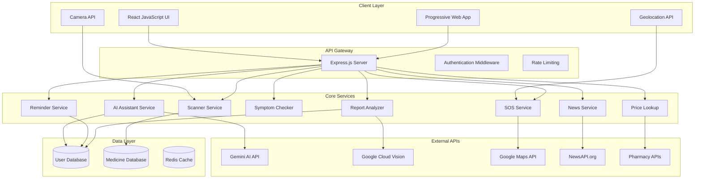

# Design Document

## Overview

Mediot is a comprehensive medical assistance web application built using a modern React JavaScript frontend with a Node.js Express backend. The system is designed with a microservices-oriented architecture to handle multiple medical features including scanning, AI assistance, medication management, and emergency services. The application prioritizes mobile-first responsive design with smooth animations and intuitive user experience.

## Architecture

### High-Level Architecture



### Technology Stack

**Frontend:**
- React 19.1.0 with JavaScript (ES6+)
- Tailwind CSS for styling
- Headless UI for accessible components
- React Router for navigation
- Axios for API communication
- React Dropzone for file uploads
- Framer Motion for animations
- Workbox for PWA capabilities

**Backend:**
- Node.js with Express.js
- JavaScript (ES6+) with modern syntax
- Helmet for security
- CORS for cross-origin requests
- Rate limiting for API protection
- Multer for file uploads
- Sharp for image processing

**External Services:**
- Google Gemini AI for chatbot
- Google Cloud Vision for OCR
- Google Maps API for location services
- NewsAPI.org for healthcare news
- Various pharmacy APIs for price comparison

**Database & Storage:**
- MongoDB with Mongoose ODM for primary data storage
- MongoDB Atlas for cloud database hosting
- Local storage for offline capabilities
- IndexedDB for large data storage

## Components and Interfaces

### Frontend Components

#### Core Layout Components
```javascript
// AppLayout Component Props
const AppLayoutProps = {
  children: PropTypes.node.isRequired,
  showNavigation: PropTypes.bool
};

// Navigation Component Props
const NavigationProps = {
  currentRoute: PropTypes.string.isRequired,
  userProfile: PropTypes.object.isRequired
};

// Header Component Props
const HeaderProps = {
  title: PropTypes.string.isRequired,
  showBack: PropTypes.bool,
  actions: PropTypes.node
};
```

#### Scanner Components
```javascript
// CameraScanner Component Props
const CameraScannerProps = {
  scanType: PropTypes.oneOf(['barcode', 'qr', 'pill', 'document']).isRequired,
  onScanResult: PropTypes.func.isRequired,
  onError: PropTypes.func.isRequired
};

// Scan Result Object Structure
const ScanResult = {
  type: 'barcode' | 'qr' | 'pill' | 'document',
  data: String,
  confidence: Number,
  timestamp: Date
};

// MedicineInfo Component Props
const MedicineInfoProps = {
  medicine: PropTypes.object.isRequired,
  showActions: PropTypes.bool
};
```

#### AI Assistant Components
```javascript
// ChatInterface Component Props
const ChatInterfaceProps = {
  messages: PropTypes.array.isRequired,
  onSendMessage: PropTypes.func.isRequired,
  isLoading: PropTypes.bool.isRequired
};

// Chat Message Object Structure
const ChatMessage = {
  id: String,
  content: String,
  sender: 'user' | 'assistant',
  timestamp: Date,
  context: Object // ScanResult or ReportData
};
```

#### Reminder Components
```javascript
// ReminderForm Component Props
const ReminderFormProps = {
  medicine: PropTypes.object,
  onSave: PropTypes.func.isRequired,
  onCancel: PropTypes.func.isRequired
};

// ReminderList Component Props
const ReminderListProps = {
  reminders: PropTypes.array.isRequired,
  onEdit: PropTypes.func.isRequired,
  onDelete: PropTypes.func.isRequired,
  onMarkTaken: PropTypes.func.isRequired
};
```

### Backend API Interfaces

#### Scanner Service
```javascript
// Scanner Service Methods
class ScannerService {
  async scanBarcode(imageData) {
    // Returns MedicineData object
  }
  
  async scanQRCode(imageData) {
    // Returns string data
  }
  
  async identifyPill(imageData) {
    // Returns MedicineData object
  }
  
  async extractTextFromDocument(imageData) {
    // Returns extracted text string
  }
}

// Medicine Data Object Structure
const MedicineData = {
  id: String,
  name: String,
  genericName: String,
  dosage: String,
  manufacturer: String,
  uses: [String],
  sideEffects: [String],
  interactions: [String],
  price: Object
};
```

#### AI Assistant Service
```javascript
// AI Service Methods
class AIService {
  async processQuery(query, context = null) {
    // Returns AIResponse object
  }
  
  async analyzeMedicineInteraction(medicines) {
    // Returns InteractionAnalysis object
  }
  
  async provideDosageGuidance(medicine, userProfile) {
    // Returns DosageGuidance object
  }
}

// AI Response Object Structure
const AIResponse = {
  content: String,
  confidence: Number,
  sources: [String],
  followUpQuestions: [String]
};
```

#### Report Analyzer Service
```javascript
// Report Analyzer Methods
class ReportAnalyzer {
  async analyzeReport(fileData, fileType) {
    // Returns ReportAnalysis object
  }
  
  async extractHealthMetrics(reportText) {
    // Returns HealthMetrics object
  }
  
  async flagAbnormalValues(metrics) {
    // Returns array of AbnormalFlag objects
  }
}

// Report Analysis Object Structure
const ReportAnalysis = {
  extractedText: String,
  healthMetrics: Object,
  abnormalFlags: [Object],
  summary: String,
  confidence: Number
};
```

## Data Models

### MongoDB Schema Models

#### User Profile Schema
```javascript
const mongoose = require('mongoose');

const userProfileSchema = new mongoose.Schema({
  email: { type: String, required: true, unique: true },
  name: { type: String, required: true },
  dateOfBirth: { type: Date },
  gender: { type: String, enum: ['male', 'female', 'other'] },
  allergies: [String],
  chronicConditions: [String],
  emergencyContacts: [{
    name: String,
    phone: String,
    email: String,
    relationship: String
  }],
  preferences: {
    language: { type: String, default: 'en' },
    notifications: {
      reminders: { type: Boolean, default: true },
      news: { type: Boolean, default: true },
      emergency: { type: Boolean, default: true }
    },
    theme: { type: String, enum: ['light', 'dark', 'auto'], default: 'auto' },
    units: { type: String, enum: ['metric', 'imperial'], default: 'metric' }
  }
}, { timestamps: true });
```

#### Medicine and Reminder Schemas
```javascript
const reminderSchema = new mongoose.Schema({
  userId: { type: mongoose.Schema.Types.ObjectId, ref: 'User', required: true },
  medicineId: String,
  medicineName: { type: String, required: true },
  dosage: { type: String, required: true },
  frequency: {
    type: String,
    enum: ['once', 'twice', 'thrice', 'four_times', 'custom'],
    required: true
  },
  startDate: { type: Date, required: true },
  endDate: Date,
  times: [String], // Array of time strings like "08:00", "14:00"
  isActive: { type: Boolean, default: true },
  adherenceLog: [{
    scheduledTime: Date,
    takenTime: Date,
    status: { type: String, enum: ['taken', 'missed', 'skipped'] },
    notes: String
  }]
}, { timestamps: true });

const medicineSchema = new mongoose.Schema({
  name: { type: String, required: true },
  genericName: String,
  dosage: String,
  manufacturer: String,
  uses: [String],
  sideEffects: [String],
  interactions: [String],
  barcode: String,
  imageUrl: String,
  price: {
    amount: Number,
    currency: String,
    source: String,
    lastUpdated: Date
  }
}, { timestamps: true });
```

#### Health Data Schemas
```javascript
const healthMetricsSchema = new mongoose.Schema({
  userId: { type: mongoose.Schema.Types.ObjectId, ref: 'User', required: true },
  reportId: String,
  bloodSugar: Number,
  bloodPressure: {
    systolic: Number,
    diastolic: Number
  },
  cholesterol: {
    total: Number,
    hdl: Number,
    ldl: Number
  },
  hemoglobin: Number,
  weight: Number,
  temperature: Number,
  heartRate: Number,
  testDate: { type: Date, default: Date.now },
  abnormalFlags: [{
    metric: String,
    value: Number,
    normalRange: {
      min: Number,
      max: Number
    },
    severity: { type: String, enum: ['low', 'high', 'critical'] },
    recommendation: String
  }]
}, { timestamps: true });

const reportSchema = new mongoose.Schema({
  userId: { type: mongoose.Schema.Types.ObjectId, ref: 'User', required: true },
  fileName: String,
  fileType: String,
  extractedText: String,
  healthMetrics: { type: mongoose.Schema.Types.ObjectId, ref: 'HealthMetrics' },
  summary: String,
  confidence: Number,
  processingStatus: { type: String, enum: ['pending', 'processed', 'failed'], default: 'pending' }
}, { timestamps: true });
```

## Error Handling

### Frontend Error Handling
- Global error boundary for React components
- API error interceptors with user-friendly messages
- Offline detection and graceful degradation
- Retry mechanisms for failed requests
- Toast notifications for user feedback

### Backend Error Handling
- Centralized error handling middleware
- Structured error responses with error codes
- Request validation with detailed error messages
- Rate limiting with clear feedback
- Logging and monitoring for debugging

### Error Response Format
```javascript
// Standard Error Response Structure
const ErrorResponse = {
  error: String,        // Error type
  message: String,      // User-friendly message
  code: String,         // Optional error code
  details: Object,      // Optional additional details
  timestamp: String     // ISO timestamp
};
```

## Testing Strategy

### Frontend Testing
- Unit tests for utility functions and hooks
- Component testing with React Testing Library
- Integration tests for user workflows
- E2E tests for critical paths using Cypress
- Visual regression testing for UI consistency
- Performance testing for mobile devices

### Backend Testing
- Unit tests for service functions
- Integration tests for API endpoints
- Database testing with test fixtures
- Security testing for authentication and authorization
- Load testing for scalability
- API contract testing

### Testing Tools
- Jest for unit and integration tests
- React Testing Library for component tests
- Supertest for API testing
- Cypress for E2E testing
- Lighthouse for performance testing

## Mobile Responsiveness Implementation

### Responsive Design System
```css
/* Tailwind CSS Breakpoints */
/* Mobile First Approach */
.container {
  width: 100%;
  padding: 1rem;
}

/* Small devices (640px and up) */
@media (min-width: 640px) {
  .container {
    max-width: 640px;
    padding: 1.5rem;
  }
}

/* Medium devices (768px and up) */
@media (min-width: 768px) {
  .container {
    max-width: 768px;
    padding: 2rem;
  }
}

/* Large devices (1024px and up) */
@media (min-width: 1024px) {
  .container {
    max-width: 1024px;
  }
}
```

### Mobile-Specific Components
- **Mobile Navigation**: Hamburger menu with slide-out drawer
- **Touch-Friendly Buttons**: Minimum 44px height with adequate spacing
- **Mobile Forms**: Single-column layout with large input fields
- **Card Layouts**: Stacked cards with condensed information
- **Bottom Sheets**: Modal dialogs that slide up from bottom
- **Swipe Gestures**: Horizontal swipe for image carousels and navigation

### Responsive Layout Patterns
- **Header**: Fixed header with hamburger menu on mobile
- **Navigation**: Bottom tab bar for primary navigation on mobile
- **Content**: Single-column layout with proper spacing
- **Sidebars**: Convert to collapsible sections on mobile
- **Tables**: Horizontal scroll or card-based layout on mobile
- **Images**: Responsive images with proper aspect ratios

### Mobile Performance Optimizations
- **Critical CSS**: Inline critical styles for above-the-fold content
- **Image Optimization**: WebP format with fallbacks, lazy loading
- **Code Splitting**: Load only necessary JavaScript for each page
- **Service Worker**: Cache static assets and API responses
- **Compression**: Gzip/Brotli compression for all assets

## Security Considerations

### Authentication & Authorization
- JWT-based authentication
- Refresh token rotation
- Role-based access control
- Session management with Redis

### Data Protection
- HTTPS enforcement
- Input validation and sanitization
- SQL injection prevention
- XSS protection with CSP headers
- File upload validation and scanning

### Privacy & Compliance
- GDPR compliance for EU users
- HIPAA considerations for health data
- Data encryption at rest and in transit
- User consent management
- Data retention policies

## Performance Optimization

### Frontend Optimization
- Code splitting and lazy loading
- Image optimization and lazy loading
- Service worker for caching
- Bundle size optimization
- Virtual scrolling for large lists

### Backend Optimization
- Database query optimization
- Redis caching for frequent requests
- Image compression and resizing
- API response compression
- Connection pooling

### Mobile Performance and Responsiveness
- Progressive Web App (PWA) capabilities with offline functionality
- Mobile-first responsive design with CSS Grid and Flexbox
- Touch-optimized interactions with 44px minimum touch targets
- Viewport meta tag configuration for proper mobile scaling
- Responsive breakpoints: 640px (sm), 768px (md), 1024px (lg), 1280px (xl)
- Collapsible navigation and hamburger menus for mobile
- Bottom sheet modals and slide-up panels for mobile interactions
- Swipe gestures for image galleries and navigation
- Reduced motion for accessibility and battery optimization
- Image optimization with responsive images and lazy loading

## Deployment Architecture

### Development Environment
- Local development with hot reloading (React + Nodemon)
- MongoDB local instance or MongoDB Atlas
- Environment-specific configurations (.env files)
- Mock services for external APIs during development

### Vercel Production Environment
- **Frontend**: Deployed as static React build on Vercel
- **Backend**: Deployed as Vercel serverless functions
- **Database**: MongoDB Atlas cloud database
- **File Storage**: Vercel Blob for image uploads
- **Environment Variables**: Managed through Vercel dashboard

### Vercel Deployment Configuration
```javascript
// vercel.json
{
  "version": 2,
  "builds": [
    {
      "src": "client/package.json",
      "use": "@vercel/static-build",
      "config": {
        "distDir": "build"
      }
    },
    {
      "src": "server/index.js",
      "use": "@vercel/node"
    }
  ],
  "routes": [
    {
      "src": "/api/(.*)",
      "dest": "/server/index.js"
    },
    {
      "src": "/(.*)",
      "dest": "/client/build/$1"
    }
  ]
}
```

### MongoDB Atlas Integration
- Cloud-hosted MongoDB database
- Automatic scaling and backup
- Built-in security features
- Connection string stored in environment variables
- Mongoose ODM for data modeling

### CI/CD Pipeline with Vercel
- Automatic deployment on git push to main branch
- Preview deployments for pull requests
- Environment variable management
- Build optimization and caching
- Automatic HTTPS and CDN distribution