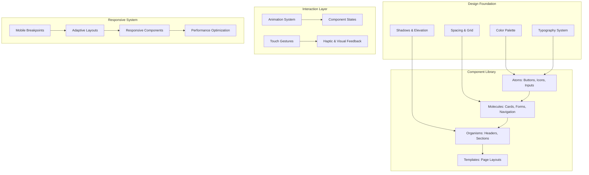

# Premium Mobile UI Design Document

## Overview

This design document outlines the transformation of the existing Mediot medical application into a premium, mobile-first healthcare application. The design focuses on creating a professional-grade user interface that combines modern aesthetics with medical application requirements, ensuring accessibility, performance, and user engagement while maintaining all existing functionality.

## Architecture

### Design System Architecture



### Technology Stack Enhancement

**Frontend Enhancements:**
- **Framer Motion**: Advanced animations and micro-interactions
- **React Spring**: Physics-based animations for natural feel
- **Lottie React**: Complex animations and illustrations
- **React Gesture**: Touch gesture recognition and handling
- **Tailwind CSS**: Utility-first styling with custom design tokens
- **Headless UI**: Accessible component primitives
- **React Hook Form**: Optimized form handling with validation
- **React Virtual**: Virtual scrolling for performance
- **Workbox**: Advanced PWA capabilities and offline support

**Design Tools Integration:**
- **Figma Tokens**: Design token synchronization
- **Storybook**: Component documentation and testing
- **Chromatic**: Visual regression testing
- **Lighthouse**: Performance and accessibility auditing

## Components and Interfaces

### Design System Foundation

#### Color Palette
```javascript
// Medical-focused color system
const colorSystem = {
  primary: {
    50: '#f0f9ff',   // Light blue tints
    100: '#e0f2fe',
    500: '#0ea5e9',  // Primary medical blue
    600: '#0284c7',
    900: '#0c4a6e'   // Dark blue
  },
  secondary: {
    50: '#f8fafc',   // Neutral grays
    100: '#f1f5f9',
    500: '#64748b',
    600: '#475569',
    900: '#0f172a'
  },
  accent: {
    50: '#fef7ee',   // Warm orange for CTAs
    500: '#f97316',
    600: '#ea580c'
  },
  semantic: {
    success: '#10b981',  // Green for positive states
    warning: '#f59e0b',  // Amber for warnings
    error: '#ef4444',    // Red for errors
    info: '#3b82f6'      // Blue for information
  },
  medical: {
    heart: '#dc2626',    // Medical red
    pulse: '#059669',    // Medical green
    scan: '#7c3aed',     // Medical purple
    emergency: '#dc2626' // Emergency red
  }
};
```

#### Typography System
```javascript
// Mobile-optimized typography scale
const typographySystem = {
  fontFamily: {
    sans: ['Inter', 'system-ui', 'sans-serif'],
    mono: ['JetBrains Mono', 'monospace']
  },
  fontSize: {
    xs: ['12px', { lineHeight: '16px' }],
    sm: ['14px', { lineHeight: '20px' }],
    base: ['16px', { lineHeight: '24px' }],  // Minimum for mobile
    lg: ['18px', { lineHeight: '28px' }],
    xl: ['20px', { lineHeight: '28px' }],
    '2xl': ['24px', { lineHeight: '32px' }],
    '3xl': ['30px', { lineHeight: '36px' }]
  },
  fontWeight: {
    normal: '400',
    medium: '500',
    semibold: '600',
    bold: '700'
  }
};
```

#### Spacing and Layout System
```javascript
// 8px base unit system
const spacingSystem = {
  spacing: {
    0: '0px',
    1: '4px',    // 0.5 * base
    2: '8px',    // 1 * base
    3: '12px',   // 1.5 * base
    4: '16px',   // 2 * base
    5: '20px',   // 2.5 * base
    6: '24px',   // 3 * base
    8: '32px',   // 4 * base
    10: '40px',  // 5 * base
    12: '48px',  // 6 * base
    16: '64px',  // 8 * base
    20: '80px'   // 10 * base
  },
  borderRadius: {
    none: '0px',
    sm: '4px',
    DEFAULT: '8px',
    md: '12px',
    lg: '16px',
    xl: '24px',
    full: '9999px'
  }
};
```

### Premium Component Library

#### Enhanced Button System
```javascript
// Button component with premium styling and interactions
const ButtonVariants = {
  primary: {
    base: 'bg-primary-500 text-white shadow-lg shadow-primary-500/25',
    hover: 'hover:bg-primary-600 hover:shadow-xl hover:shadow-primary-500/30',
    active: 'active:bg-primary-700 active:scale-95',
    disabled: 'disabled:bg-gray-300 disabled:shadow-none disabled:cursor-not-allowed'
  },
  secondary: {
    base: 'bg-white text-primary-600 border-2 border-primary-500 shadow-md',
    hover: 'hover:bg-primary-50 hover:shadow-lg',
    active: 'active:bg-primary-100 active:scale-95'
  },
  floating: {
    base: 'bg-primary-500 text-white rounded-full shadow-2xl shadow-primary-500/40',
    hover: 'hover:shadow-3xl hover:shadow-primary-500/50 hover:scale-105',
    active: 'active:scale-95'
  }
};

// Touch target optimization
const touchTargets = {
  minimum: '44px',  // iOS/Android minimum
  comfortable: '48px',
  large: '56px'
};
```

#### Premium Card Components
```javascript
// Enhanced card system with elevation and interactions
const CardVariants = {
  elevated: {
    base: 'bg-white rounded-xl shadow-lg shadow-gray-900/10 border border-gray-100',
    hover: 'hover:shadow-xl hover:shadow-gray-900/15 hover:-translate-y-1',
    transition: 'transition-all duration-200 ease-out'
  },
  interactive: {
    base: 'bg-white rounded-xl shadow-md border border-gray-100 cursor-pointer',
    hover: 'hover:shadow-lg hover:border-primary-200 hover:bg-primary-50/30',
    active: 'active:scale-98 active:shadow-sm'
  },
  medical: {
    base: 'bg-gradient-to-br from-white to-primary-50/30 rounded-xl shadow-lg border border-primary-100',
    accent: 'border-l-4 border-l-primary-500'
  }
};
```

#### Mobile Navigation System
```javascript
// Bottom navigation for mobile-first design
const BottomNavigation = {
  container: 'fixed bottom-0 left-0 right-0 bg-white border-t border-gray-200 shadow-2xl',
  tabContainer: 'flex justify-around items-center px-2 py-1',
  tab: {
    base: 'flex flex-col items-center justify-center p-2 min-w-[60px] rounded-lg',
    active: 'text-primary-600 bg-primary-50',
    inactive: 'text-gray-500',
    transition: 'transition-all duration-150 ease-out'
  },
  icon: {
    size: '24px',
    activeColor: 'text-primary-600',
    inactiveColor: 'text-gray-400'
  },
  label: {
    fontSize: '12px',
    fontWeight: '500',
    marginTop: '2px'
  }
};

// Hamburger menu for secondary navigation
const HamburgerMenu = {
  overlay: 'fixed inset-0 bg-black/50 backdrop-blur-sm z-40',
  drawer: 'fixed left-0 top-0 h-full w-80 bg-white shadow-2xl z-50 transform transition-transform duration-300',
  header: 'p-6 border-b border-gray-100 bg-gradient-to-r from-primary-500 to-primary-600 text-white',
  menuItem: 'flex items-center p-4 hover:bg-gray-50 transition-colors duration-150'
};
```

### Animation and Interaction System

#### Micro-Interactions
```javascript
// Framer Motion animation variants
const animationVariants = {
  fadeIn: {
    initial: { opacity: 0, y: 20 },
    animate: { opacity: 1, y: 0 },
    transition: { duration: 0.3, ease: 'easeOut' }
  },
  slideUp: {
    initial: { opacity: 0, y: 50 },
    animate: { opacity: 1, y: 0 },
    transition: { duration: 0.4, ease: [0.25, 0.46, 0.45, 0.94] }
  },
  scaleIn: {
    initial: { opacity: 0, scale: 0.9 },
    animate: { opacity: 1, scale: 1 },
    transition: { duration: 0.2, ease: 'easeOut' }
  },
  staggerChildren: {
    animate: {
      transition: {
        staggerChildren: 0.1,
        delayChildren: 0.2
      }
    }
  }
};

// Loading animations
const loadingAnimations = {
  skeleton: 'animate-pulse bg-gradient-to-r from-gray-200 via-gray-300 to-gray-200 bg-[length:200%_100%]',
  spinner: 'animate-spin rounded-full border-2 border-gray-300 border-t-primary-500',
  dots: 'animate-bounce'
};
```

#### Gesture Recognition
```javascript
// Touch gesture configurations
const gestureConfig = {
  swipe: {
    threshold: 50,      // Minimum distance for swipe
    velocity: 0.3,      // Minimum velocity
    direction: ['left', 'right', 'up', 'down']
  },
  pinch: {
    threshold: 0.1,     // Minimum scale change
    maxScale: 3,        // Maximum zoom level
    minScale: 0.5       // Minimum zoom level
  },
  longPress: {
    duration: 500,      // Milliseconds to trigger
    threshold: 10       // Maximum movement allowed
  }
};
```

### Mobile-First Layout System

#### Responsive Breakpoints
```javascript
// Mobile-first breakpoint system
const breakpoints = {
  xs: '320px',    // Small phones
  sm: '375px',    // Standard phones
  md: '414px',    // Large phones
  lg: '768px',    // Tablets
  xl: '1024px',   // Desktop
  '2xl': '1280px' // Large desktop
};

// Container system
const containers = {
  mobile: 'px-4 mx-auto max-w-sm',
  tablet: 'px-6 mx-auto max-w-2xl',
  desktop: 'px-8 mx-auto max-w-6xl'
};
```

#### Layout Patterns
```javascript
// Common mobile layout patterns
const layoutPatterns = {
  singleColumn: {
    container: 'flex flex-col space-y-4 p-4',
    section: 'w-full'
  },
  cardGrid: {
    container: 'grid grid-cols-1 sm:grid-cols-2 lg:grid-cols-3 gap-4 p-4',
    card: 'w-full'
  },
  listView: {
    container: 'divide-y divide-gray-100',
    item: 'p-4 hover:bg-gray-50 transition-colors'
  },
  bottomSheet: {
    overlay: 'fixed inset-0 bg-black/50 z-40',
    sheet: 'fixed bottom-0 left-0 right-0 bg-white rounded-t-2xl shadow-2xl z-50 max-h-[90vh] overflow-y-auto'
  }
};
```

## Data Models

### Design Token System
```javascript
// Design tokens for consistency
const designTokens = {
  colors: colorSystem,
  typography: typographySystem,
  spacing: spacingSystem,
  shadows: {
    sm: '0 1px 2px 0 rgb(0 0 0 / 0.05)',
    DEFAULT: '0 1px 3px 0 rgb(0 0 0 / 0.1), 0 1px 2px -1px rgb(0 0 0 / 0.1)',
    md: '0 4px 6px -1px rgb(0 0 0 / 0.1), 0 2px 4px -2px rgb(0 0 0 / 0.1)',
    lg: '0 10px 15px -3px rgb(0 0 0 / 0.1), 0 4px 6px -4px rgb(0 0 0 / 0.1)',
    xl: '0 20px 25px -5px rgb(0 0 0 / 0.1), 0 8px 10px -6px rgb(0 0 0 / 0.1)',
    '2xl': '0 25px 50px -12px rgb(0 0 0 / 0.25)',
    inner: 'inset 0 2px 4px 0 rgb(0 0 0 / 0.05)'
  },
  animations: {
    duration: {
      fast: '150ms',
      normal: '300ms',
      slow: '500ms'
    },
    easing: {
      linear: 'linear',
      out: 'cubic-bezier(0.25, 0.46, 0.45, 0.94)',
      in: 'cubic-bezier(0.55, 0.06, 0.68, 0.19)',
      inOut: 'cubic-bezier(0.42, 0, 0.58, 1)'
    }
  }
};
```

### Component State Management
```javascript
// Component state system for consistency
const componentStates = {
  interactive: {
    default: 'cursor-pointer transition-all duration-150',
    hover: 'hover:scale-105 hover:shadow-md',
    active: 'active:scale-95',
    focus: 'focus:outline-none focus:ring-2 focus:ring-primary-500 focus:ring-offset-2',
    disabled: 'disabled:opacity-50 disabled:cursor-not-allowed disabled:hover:scale-100'
  },
  loading: {
    container: 'relative overflow-hidden',
    overlay: 'absolute inset-0 bg-white/80 flex items-center justify-center',
    spinner: 'w-6 h-6 border-2 border-primary-500 border-t-transparent rounded-full animate-spin'
  },
  error: {
    container: 'border-red-200 bg-red-50',
    text: 'text-red-600',
    icon: 'text-red-500'
  }
};
```

## Error Handling

### User-Friendly Error States
```javascript
// Premium error handling with helpful messaging
const errorStates = {
  network: {
    title: 'Connection Issue',
    message: 'Please check your internet connection and try again.',
    action: 'Retry',
    icon: 'wifi-off'
  },
  loading: {
    title: 'Loading Failed',
    message: 'We couldn\'t load this content. Please try again.',
    action: 'Refresh',
    icon: 'refresh'
  },
  permission: {
    title: 'Permission Required',
    message: 'This feature needs camera access to work properly.',
    action: 'Grant Permission',
    icon: 'camera'
  },
  notFound: {
    title: 'Content Not Found',
    message: 'The content you\'re looking for isn\'t available.',
    action: 'Go Back',
    icon: 'search'
  }
};
```

### Graceful Degradation
- Progressive enhancement for advanced features
- Fallback UI components for unsupported browsers
- Offline-first design with clear status indicators
- Reduced functionality modes for low-performance devices

## Testing Strategy

### Visual Testing
- **Storybook**: Component isolation and documentation
- **Chromatic**: Visual regression testing for UI changes
- **Percy**: Cross-browser visual testing
- **Lighthouse**: Performance and accessibility auditing

### Interaction Testing
- **Cypress**: E2E testing for user workflows
- **Testing Library**: Component interaction testing
- **Jest**: Unit testing for utility functions
- **MSW**: API mocking for consistent testing

### Performance Testing
- **Web Vitals**: Core performance metrics monitoring
- **Bundle Analyzer**: JavaScript bundle optimization
- **Lighthouse CI**: Automated performance testing
- **Real Device Testing**: Testing on actual mobile devices

### Accessibility Testing
- **axe-core**: Automated accessibility testing
- **Screen Reader Testing**: Manual testing with assistive technologies
- **Keyboard Navigation**: Testing all interactions without mouse
- **Color Contrast**: Automated contrast ratio validation

## Mobile Performance Optimization

### Loading Performance
```javascript
// Performance optimization strategies
const performanceOptimizations = {
  codesplitting: {
    routes: 'React.lazy() for route-based splitting',
    components: 'Dynamic imports for heavy components',
    libraries: 'Separate vendor bundles'
  },
  imageOptimization: {
    formats: ['WebP', 'AVIF', 'JPEG'],
    sizes: 'Responsive image sizes',
    loading: 'Lazy loading with intersection observer'
  },
  caching: {
    serviceWorker: 'Cache-first strategy for static assets',
    apiCache: 'Stale-while-revalidate for API responses',
    localStorage: 'Persistent user preferences'
  }
};
```

### Runtime Performance
- **Virtual Scrolling**: For long lists and data tables
- **Memoization**: React.memo and useMemo for expensive calculations
- **Debouncing**: Input handling and API calls
- **Intersection Observer**: Lazy loading and infinite scroll
- **Web Workers**: Heavy computations off main thread

## Accessibility Implementation

### WCAG 2.1 AA Compliance
```javascript
// Accessibility features implementation
const accessibilityFeatures = {
  screenReader: {
    ariaLabels: 'Descriptive labels for all interactive elements',
    landmarks: 'Proper semantic HTML structure',
    liveRegions: 'Dynamic content announcements'
  },
  keyboard: {
    focusManagement: 'Logical tab order and focus indicators',
    shortcuts: 'Keyboard shortcuts for common actions',
    skipLinks: 'Skip to main content functionality'
  },
  visual: {
    contrast: 'Minimum 4.5:1 contrast ratio',
    fontSize: 'Scalable text up to 200%',
    colorBlindness: 'Color-independent information design'
  },
  motor: {
    touchTargets: 'Minimum 44px touch targets',
    gestures: 'Alternative input methods',
    timing: 'No time-based interactions'
  }
};
```

### Assistive Technology Support
- **Voice Control**: Voice navigation and commands
- **Switch Navigation**: Support for switch-based input devices
- **High Contrast Mode**: Automatic detection and adaptation
- **Reduced Motion**: Respect user's motion preferences

## Implementation Phases

### Phase 1: Foundation (Week 1-2)
- Set up design system and tokens
- Implement core component library
- Create responsive layout system
- Basic animation framework

### Phase 2: Components (Week 3-4)
- Premium button and form components
- Enhanced navigation systems
- Card and layout components
- Loading and error states

### Phase 3: Interactions (Week 5-6)
- Gesture recognition implementation
- Advanced animations and transitions
- Touch-optimized interactions
- Haptic feedback integration

### Phase 4: Optimization (Week 7-8)
- Performance optimization
- Accessibility implementation
- Cross-device testing
- Final polish and refinements

## Success Metrics

### User Experience Metrics
- **Task Completion Rate**: >95% for core workflows
- **Time to Complete Tasks**: 30% reduction from current
- **User Satisfaction Score**: >4.5/5 in usability testing
- **Accessibility Score**: WCAG 2.1 AA compliance

### Technical Performance Metrics
- **First Contentful Paint**: <1.5s on 3G
- **Largest Contentful Paint**: <2.5s on 3G
- **Cumulative Layout Shift**: <0.1
- **First Input Delay**: <100ms
- **Frame Rate**: Consistent 60fps during interactions

### Business Impact Metrics
- **User Engagement**: 40% increase in session duration
- **Feature Adoption**: 25% increase in feature usage
- **User Retention**: 20% improvement in 30-day retention
- **App Store Rating**: Target 4.8+ stars with premium UI